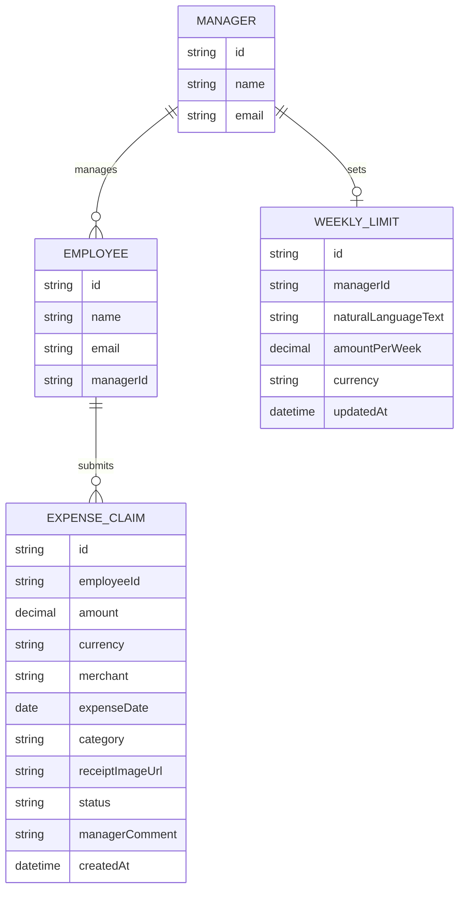

# Domain Model

The core entities behind expense claims: who reports to whom, the claims an
employee submits, and the single weekly limit each manager sets for their team.

- **Employee** and **Manager** are both signed-in people; `Employee.managerId`
is what makes an employee part of a manager's team.
- **ExpenseClaim.status** is one of `pending`, `approved`, `rejected`.
- **WeeklyLimit** is one row per manager (their team's single limit): it keeps
both the manager's original `naturalLanguageText` and the
`amountPerWeek`/`currency` the limit-agent derived from it.

