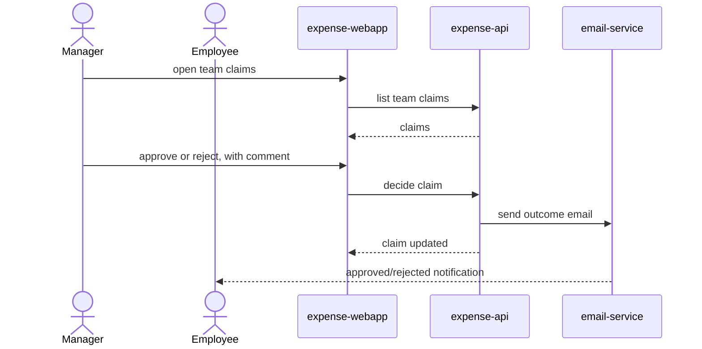

# Manager reviews a claim

A Manager reviews their team's submitted claims and approves or rejects one;
the employee is emailed the outcome.

```mermaid
sequenceDiagram
    actor Manager
    actor Employee
    participant expense-webapp
    participant expense-api
    participant email-service

    Manager->>expense-webapp: open team claims
    expense-webapp->>expense-api: list team claims
    expense-api-->>expense-webapp: claims
    Manager->>expense-webapp: approve or reject, with comment
    expense-webapp->>expense-api: decide claim
    expense-api->>email-service: send outcome email
    expense-api-->>expense-webapp: claim updated
    email-service-->>Employee: approved/rejected notification
```

