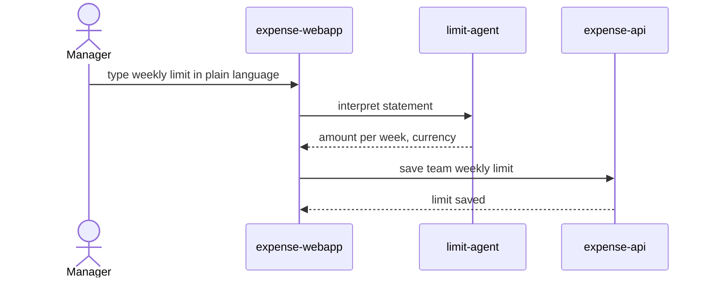

# Manager sets the team's weekly limit

A Manager states the team's weekly expense limit in plain language, and the
limit agent turns it into the structured amount the product uses.

```mermaid
sequenceDiagram
    actor Manager
    participant expense-webapp
    participant limit-agent
    participant expense-api

    Manager->>expense-webapp: type weekly limit in plain language
    expense-webapp->>limit-agent: interpret statement
    limit-agent-->>expense-webapp: amount per week, currency
    expense-webapp->>expense-api: save team weekly limit
    expense-api-->>expense-webapp: limit saved
```

