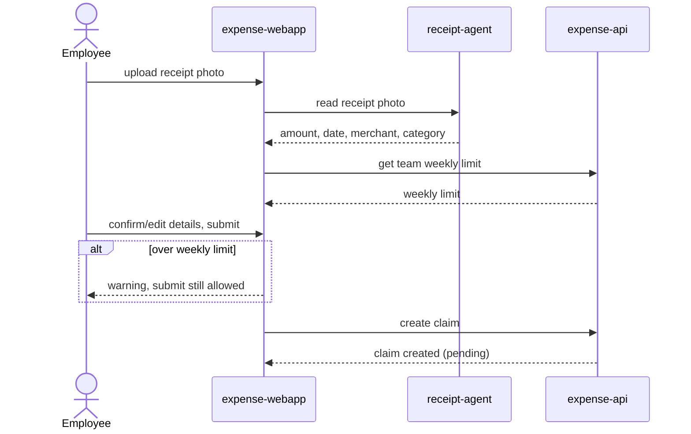

# Submit an expense claim

An Employee photographs a receipt, the receipt agent pre-fills the claim, and
the employee confirms it — seeing their team's weekly limit before sending it.

```mermaid
sequenceDiagram
    actor Employee
    participant expense-webapp
    participant receipt-agent
    participant expense-api

    Employee->>expense-webapp: upload receipt photo
    expense-webapp->>receipt-agent: read receipt photo
    receipt-agent-->>expense-webapp: amount, date, merchant, category
    expense-webapp->>expense-api: get team weekly limit
    expense-api-->>expense-webapp: weekly limit
    Employee->>expense-webapp: confirm/edit details, submit
    alt over weekly limit
        expense-webapp-->>Employee: warning, submit still allowed
    end
    expense-webapp->>expense-api: create claim
    expense-api-->>expense-webapp: claim created (pending)
```

